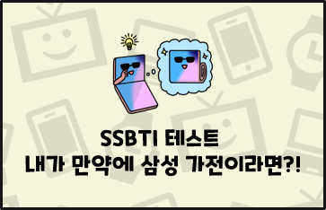
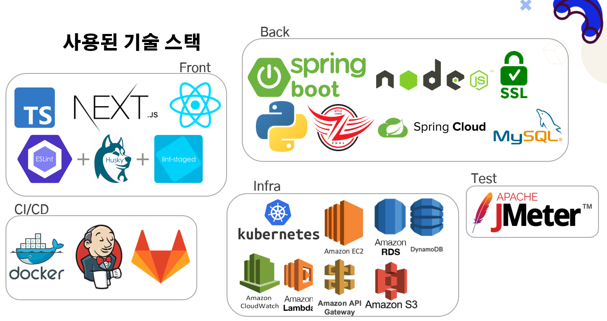
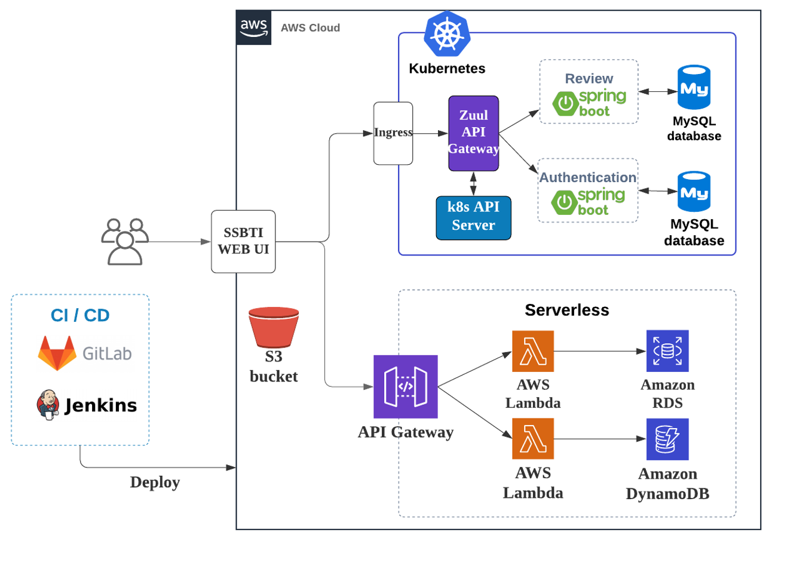
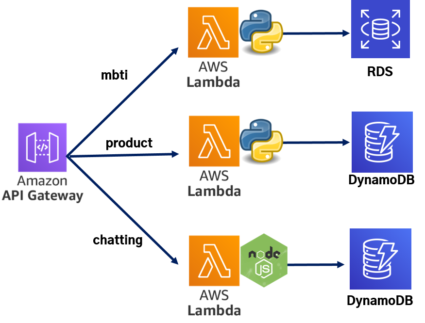
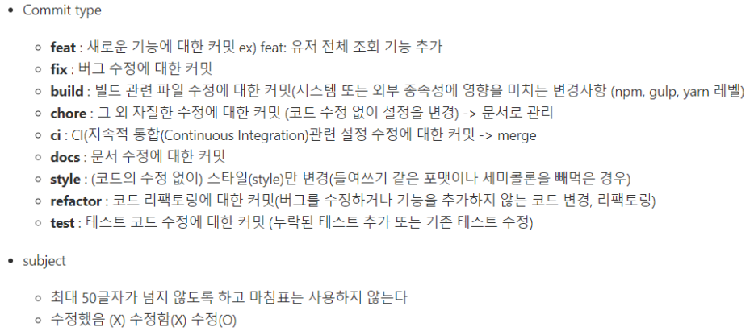

  

    <b>성격 유형 검사(MBTI)를 이용한 삼성 제품 추천 Cloud Native 서비스 개발</b>   

  

     

  

        

 

> 서비스명: SSBTI
>
> 팀명: MoSS(MBTI of SamSung)
>
> 개발 기간: 2021.02.23 ~ 2021.04.08 약 7주

## :sparkles: 서비스 개요

* MBTI(마이어스-브릭스 유형 지표 성격 검사)를 기반으로 성격을 분류하여, 

  성향에 맞는 삼성전자 제품을 추천해주고, 지인에게 공유하여 즐거움을 느낄 수 있는 서비스

## :sparkles: 서비스 특장점

* 쿠버네티스/서버리스를 통해 부하에 따른 자동 스케일링을 수행하여 고가용성 보장
* Jenkins Pipeline을 사용해 서비스별 배포 가능

## :sparkles: 서비스 차별점/독창성

* 성향별로 귀여운 캐릭터를 매칭하여 사용자에게 즐거움을 제공
* 같은 성향의 사용자들끼리 실시간 채팅 제공
* MSA로 프로젝트를 구성하여 프로젝트 확장이 편리
* 주요 기능의 경우 AWS 람다함수를 활용하고 최적화를 통해 약 1500개의 동시 요청도 에러율 0%로 처리 가능

## :family: 역할 분담

| 팀원                                    | 역할   | 내용                                            |
| --------------------------------------- | ------ | ----------------------------------------------- |
| 정현우                                  | 팀장   | 프론트엔드 개발, UI디자인, 쿠버네티스 환경 구성 |
| [송은주](mailto:010-2648-8131@daum.net) | 부팀장 | 백엔드 개발, 서버리스 환경 구성, 테스팅         |
| 권연욱                                  | 팀원   | 프론트엔드 총괄, UI디자인, 캐릭터 디자인        |
| 김종성                                  | 팀원   | 백엔드 총괄, 쿠버네티스 환경 구성, 발표         |
| 장주빈                                  | 팀원   | 백엔드 개발, 쿠버네티스 환경 구성,  UCC 제작    |

## :books: 기술 스택

## :pencil2: 서비스 아키텍처

* Serverless 상세 구조

## :sparkles:주요 기능

* SSBTI 테스트 기능
* 결과 조회, 제품 추천 및 공유 기능
* 유형 별 채팅 기능
* 리뷰 조회 기능
* 관리자 대시보드 조회 기능

## :bookmark_tabs: Branch 규칙

`{flow}/{기능명}/구역`

ex: `feature/review/be`, `hotfix/dashboard/fe`

## :bookmark_tabs: Git Convention

#### 그럼 어떻게 쓰나요?

> Add review function 
>
> 본문에는 {타입} (적용범위): 메시지 
>
> feat(pipeline) !: Add pipeline function 본문은 생략이 가능하지만, **Major버전에 대한 명시**필요하면 꼭 적어야 한다. 
>
> 추가적으로 Major 변화에 대한 메시지는 본문에 있으니까, 커밋 메시지에서 확인 못하고 넘어갈 가능성이 있기 때문에 : 앞에 !를 추가해서 본문에 내용이 있음을 알려줄 수 있다.

#### 커밋 메시지 규칙 

보통은 팀과 컨벤션을 맞추는 경우가 많은 것 같다. 그래도 보통 기본적으로 통용되는 규칙  

1. 제목과 본문을 한 줄 띄워 분리하기  
2. 제목은 영문 기준 50자 이내  
3. 제목 첫 글자를 대문자  
4. 제목 끝에 **. 금지**  
5. 제목은 **명령조**로 (git의 Built-in Convention을 따르는 것)  
6. 본문은 영문 기준 72자마다 줄 바꾸기  
7. 본문은 **어떻게**보다 **무엇을, 왜**에 맞춰 작성
