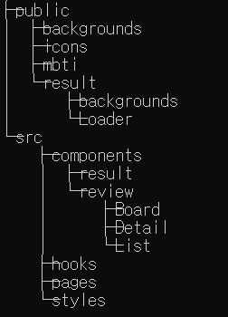

# Next.js 정리

### 프로젝트 생성

---

```jsx
mkdir frontend
cd frontend
npm init --yes
yarn add next react react-dom
yarn add -D typescript @types/node @types/react
mkdir -p src/{pages,components}
```

### 프로젝트 구조

---



- public

    정적 파일들

- src
    - components

        각 페이지에서 불러올 컴포넌트들

    - hooks

        사용자 정의 hook

    - pages

        하나의 페이지들

        파일 이름이 routing 주소가 된다 (abc.tsx로 저장하면 url주소/abc 로 접근)

    - styles

        css 파일들 (파일 이름은 원하는이름.module.css 형식)

### 유용한 function component 요소

---

src/pages/parent.tsx

```jsx
import React, { useState } from 'react'; // {react hook}
import Child from '../components/child'; // import 대문자로 시작 from 경로
import styles from '../styles/parent.module.css'; // css 파일 경로

// 부모 컴포넌트
function Parent() {

	// 자식 모달 보여줄지 결정하는 boolean 변수
	const [isModal, setModal] = useState<boolean>(false); // const [변수 이름, setter 함수 이름] = useState<변수 타입>(초기화 값);
	// 자식 모달에 넘겨줄 string 변수
	const [content, setContent] = useState<string>('');

	// 자식 모달 창 여는 method
	const openModal = () => { // function openModal() {} 와 같은 형태
		if (content == '')
	    return;

		setModal(true);
	}

	// 자식 모달 창 닫는 method
	const closeModal = () => {
		setContent('');
    setModal(false);
  };

	// input의 value를 변경하는 method
	const onChange = (e: any) => {
    setContent(e.target.value);
  };

	// enter key 눌렸을 때 실행할 method
  const handleEnterPress = (e: any) => {
    if (e.key === 'Enter')
      openModal();
  };

	// parameter가 있는 method의 경우
	const log = (str: string) => {
    if (str == '')
      return;
    
    console.log(str);
  }

	// 화면에 보여질 html
	return( // 전체 코드를 감싸는 태그 필요 
		<div>
			전달할 값 : 
			<Child isModal={isModal} close={closeModal} content={content}/> // <자식컴포넌트 사용할 변수 이름={부모 컴포넌트의 변수/함수 이름}/>
			{!isModal && // 뒤에 오는 태그는 isModal 값에 따라 실제로 제거되고 생성됨(vue의 v-if). 감싸는 태그 필요
			<input value={content} onChange={onChange} type="text" onKeyPress={handleEnterPress}>
			</input>
			<button onClick={() => log(content)}>콘솔</button>
		</div>
	);
}

export default Parent;
```

src/components/child.tsx

```jsx
import React from 'react';
import styles from '../styles/child.module.css'; // css 파일 경로

function Child(props) { // 자식 컴포넌트. 부모에서 받아옿 props
    return (
        <>
						// 부모에서 받아온 데이터는 props.변수/함수 이름으로 접근
						// 변수 ? ( <></> : <></> )의 삼항연산자 형태로 변수 값에 따라 생성/제거 될 태그 설정
            {props.isModal ? (
								// className={css파일 import한 이름.css파일에서 쓸 이름}
                <div className={styles.background}>
                    <div>
                        <div className={styles.modal}>
                            <div className={styles.content}>
                                {props.content}
                            </div>
                            <button className={styles.alertBtn} onClick={props.close}>닫기</button>
                        </div>
                    </div>
                </div>
            ) : null}
        </>
    );
}

export default Child;
```

src/styles/child.module.css

```css
.background {
  position: fixed;
  background: rgba(0, 0, 0, 0.5);
  top: 0;
  bottom: 0;
  left: 0;
  right: 0;
  z-index: 9999;
}

.modal {
  position: relative;
  width: 200px;
  height: 80px;
  box-sizing: border-box;
  margin: 50px auto;
  padding: 10px;
  background-color: white;
  border-radius: 5px;
}

.content {
  font-size: 15px;
}

.alertBtn {
  padding: 5px;
  color: white;
  background-color: black;
  border: none;
  outline: none;
  border-radius: 5px;
  float: right;
  margin-top: 10px;
  cursor: pointer;
}
```

### 자주 쓰는 코드

---

data가 update되는 것을 감지해야할 때

```jsx
import React, { useEffect } from 'react';

useEffect(()=>{
	// 실행할 코드
}, []); // [] 생략 시 컴포넌트 리렌더링 될 때마다 호출
				// []가 비어있으면 컴포넌트가 처음 나타날 때만 호출
				// [] 안에 값이 있으면 해당 값이 업데이트 될 때마다 호출
```

routing할 때

```jsx
import Router, { useRouter } from 'next/router';

const router = useRouter(); // routing된 경로에 넘어온 parameter가 있을 때 접근할 변수
const param = router.변수이름;

const moveToHome = () => {
	// '/' 경로로 이동
	Router.push('/');
}

const moveToPage = () => {
	// '/list?page=1' 경로로 이동
	Router.push({
		pathname: '/list',
		query: { page: 1 }
	})
}
```

정적 경로 접근할 때

```jsx

```

배열에 담긴 데이터를 일정한 tag 형식에 담아 보여줄 때

```jsx
const descriptions = description.map((str, idx) => 
	//key값을 지정하지 않으면 warning
	<div key={idx}> 
		{str.content}
	</div>
);
```

스크롤 하단 고정

```jsx
import React, { useRef } from 'react';

function 컴포넌트(){
	const bodyRef = useRef(null);

	// 스크롤 하단 고정 method. 원하는 상황에 맞게 호출해 사용
	const scrollToBottom = () => {
    bodyRef.current.scrollTop = bodyRef.current.scrollHeight;
  };
	
	return(
		<div>
			<div ref={el => { bodyRef.current = el; }}>
			</div>
		</div>
	);
}

export default 컴포넌트;
```

### 아이콘

---

mdi-react npm 다운 링크 : [https://www.npmjs.com/package/@mdi/react](https://www.npmjs.com/package/@mdi/react)