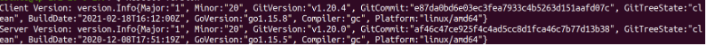
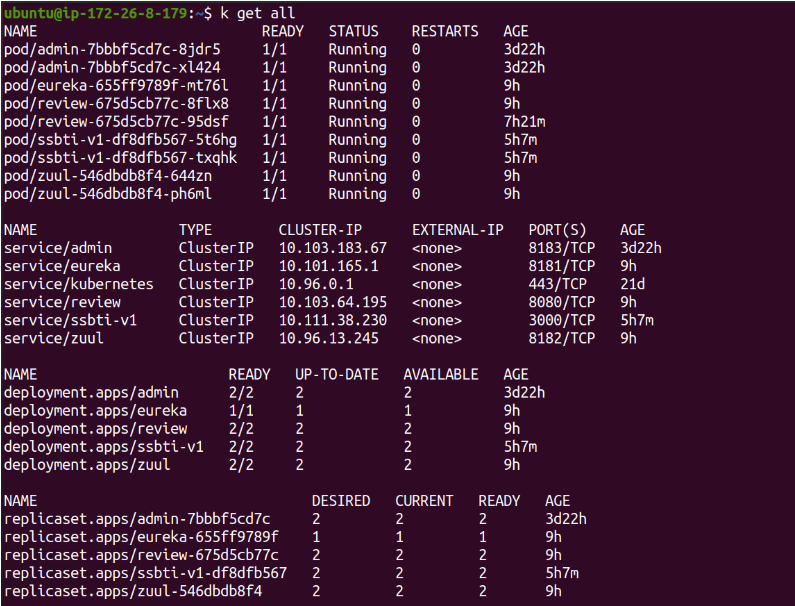
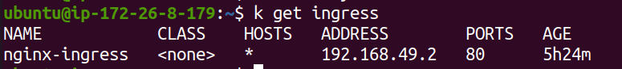
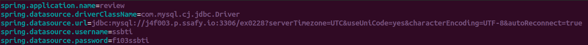

# 쿠버네티스 정리

> 생략되거나 잘못된 부분이 많을 수 있다.

## 목차

[TOC]


## 기초

[도커 기초](https://subicura.com/2017/01/19/docker-guide-for-beginners-1.html)

[쿠버네티스 기초](https://subicura.com/k8s/guide/)


## 설치

위의 쿠버네티스 기초 링크를 참조해 minikube와 kubectl을 설치한다.

minikube를 먼저 run한 후 `kubectl version`을 입력했을 때



이렇게 뜨는 것을 확인하면 끝


## 프론트,백엔드 쿠버네티스에 올리기

### 1) 먼저, 해당 프론트,백엔드를 도커 이미지로 만든다.

`nextjs`<Dockerfile>

```dockerfile
FROM node

WORKDIR /home/jenkins/workspace/ssbti/frontend

COPY package*.json ./

RUN npm i -y

COPY . .

EXPOSE 3000

CMD [ "npm", "run", "dev"]
```

`spring` <Dockerfile>

```dockerfile
FROM adoptopenjdk/openjdk11:latest
COPY build/libs/*.jar app.jar

EXPOSE 8080

ENTRYPOINT ["java", "-jar", "app.jar"]
```


프론트,백엔드 루트 디렉토리에 위 Dockerfile을 위치시킨다.

프론트,백엔드 루트 디렉토리에서 `docker build -t {dockerhub아이디}/{파일이름}` 를 입력해서

로컬에서 이미지를 생성한다.

> 주의할 점
>
>  `EXPOSE 3000` ,`EXPOSE 8080`이 부분은 열 포트 번호를 임의로 설정해주면 된다.
>
> `spring`은 빌드를 한 후에 도커파일로 이미지 빌드를 해야한다.


### 2) 이미지를 도커허브에 올린다.

1. `docker login -u {아디} -p {비번}` 으로 도커허브에 로그인한다.

2. `docker push {dockerhub아이디}/{파일이름}` 로 도커허브에 올린다.


### 3) 쿠버네티스에 프론트,백엔드 오브젝트 생성

프론트,백엔드를 쿠버네티스에서 돌리기 위해 `deployment`와 `service`를 생성해 올린다.

이때 dockerhub의 image를 pull해와서 쓴다.

> `deployment`는 `ReplicaSet`을 이용해 Pod을 업데이트하고 이력을 관리하는 쿠버네티스 오브젝트
>
> `service`를 이용해 Pod을 노출하고 클러스터 외부에서 접근하거나, Pod과 통신할 수 있게 한다.


1. 쿠버네티스 오브젝트를 만들기 위해 yml 파일을 만든다.

<예시> - ssbti.yml

```yaml
apiVersion: apps/v1
kind: Deployment
metadata:
  name: ssbti-v1
spec:
  replicas: 3
  selector:
    matchLabels:
      app: ssbti
      tier: app
      version: v1
  template:
    metadata:
      labels:
        app: ssbti
        tier: app
        version: v1
    spec:
      containers:
        - name: ssbti
          image: jhw2621/ssbti:latest
          imagePullPolicy: Always
          resources:
            requests:
              cpu: "250m"
            limits:
              cpu: "500m"
      imagePullSecrets:
        - name: dockersecret
---
apiVersion: v1
kind: Service
metadata:
  name: ssbti-v1
spec:
  ports:
    - port: 3000
      protocol: TCP
  selector:
    app: ssbti
    tier: app
    version: v1

```


2. `kubectl apply -f {파일이름.yml}` 을 입력해 쿠버네티스 오브젝트를 생성한다.

3. `kubectl get all`을 입력해 쿠버네티스 오브젝트가 잘 생성됐는지 확인한다.




## 로컬에 배포하기

`ingress`와 `service`를 사용하는 2가지 방식이 있는 데, 여기서는 `ingress`를 사용했다.

> `ingress`는 쿠버네티스 클러스터를 외부에 노출하고 그 외에 여러가지 역할을 하는 오브젝트이다.

### 1) ingress controller 설치

`ingress`를 사용하기 위해서는 `ingress controller`가 필요한 데, `minikube`는 addon으로 이를 제공해서 편리하게 할 수 있다.

`minikube addons enable ingress`를 입력해 ingress controller를 추가 시킨다.

`minikube`를 안쓰면 검색해서 찾아보고 설치하면 된다.


### 2) ingress 오브젝트 생성하기

<예시> - ingress.yml

```yaml
apiVersion: networking.k8s.io/v1
kind: Ingress
metadata:
  name: nginx-ingress
  annotations:
          #nginx.ingress.kubernetes.io/rewrite-target: /
    nginx.ingress.kubernetes.io/rewrite-target: /$1
    kubernetes.io/ingress.class: "nginx"
spec:
  rules:
  - http:
      paths:
        - path: /(.*)
          pathType: Prefix
          backend:
            service:
              name: ssbti-v1
              port:
                number: 3000
        - path: /review/(.*)
          pathType: Prefix
          backend:
            service:
              name: review
              port:
                number: 8080
```

1. `kubectl apply -f ingress.yml` 를 입력해서 쿠버네티스 ingress 오브젝트를 생성한다.

2. `kubectl get ingress`를 입력해 잘 생성됐는지 확인한다.



3. `curl {minikube IP}`를 해서 해당 프로젝트가 잘 뜨는지 확인한다.

4. 위의 yml파일에서 path는 경로이다. 경로에 따라 다른 service에 접근할 수 있다. 즉, review 관련 api들을 호출 하고 싶으면 `curl {minikube IP}/review/{정해놓은 api이름}` 이렇게 하면 된다.

   

### 3) 이렇게 생성한 ingress는 {minikube ip}를 통해 로컬(클러스터 외부)에서 접근할 수 있다.


## 인터넷에 배포하기

> EC2 기준이고, 콘솔은 쓸 수 없는 경우이다. 콘솔을 쓸 수 있으면 다르게 간단하게 하는 방법이 있는데 해당 방법은 인터넷에 치면 나온다.

### 1) nginx를 설치한다.

설치방법은 인터넷에 치면 나온다.


### 2) /etc/nginx/sites-enabled/default 파일을 수정한다.

```
~~~생략
server {
	어쩌구저쩌구
    location / {
        # First attempt to serve request as file, then
        # as directory, then fall back to displaying a 404.
        #try_files $uri $uri/ =404;
        proxy_pass http://192.168.49.2; 
        proxy_set_header X-Real-IP $remote_addr;
        proxy_set_header X-Forwarded-For $proxy_add_x_forwarded_for;
        proxy_set_header Host $http_host;
    }

}
```

`proxy_pass http://192.168.49.2` 이 부분을 `proxy_pass http://{minikube ip}` 로 바꾼다.


### 3) ec2 주소로 들어가서 프론트가 잘 뜨는지 확인한다.


## 인터넷에 올린 프론트엔드와 백엔드 통신하기

인터넷에 올려놓은 프론트엔드와 백엔드가 통신하기 위해서,

프론트엔드에서 하는 axios 요청할 때 주소는 `ec2주소/review/{정해놓은 api이름}` 이렇게 설정하면 된다.


## 쿠버네티스 클러스터 내의 mysql, spring 통신하기

실패했다. 예제를 따라해도 잘 안된다.

그래서 도커에 `mysql`을 올려서 얘와 쿠버네티스 내의 `spring`이 통신하게 했다.

### 1) 먼저 `docker-compose.yml`을 활용해 `mysql`을 올린다.

```yaml
ersion: '3'

services:
  review-db:
    image: mysql:latest
    container_name: review-db
    environment:
      MYSQL_ROOT_PASSWORD: f103ssbti
      MYSQL_DATABASE: ex0228
    ports:
      - "3306:3306"
    volumes:
      - ./mysql/custom.cnf:/etc/mysql/conf.d/custom.cnf

```

### 2) 그리고 쿠버네티스에 spring을 올린다.

1. 빌드할 때 쓰는 `application.properties`파일에서 DB의 이름과 비번,url을 설정해야한다.

<예시> - application.properties



2. 쿠버에 올릴 때 위에서 설명한 것과 비슷하게 올리는데, `yml`파일에서 `deployment`의 `spec`의 `env`를 mysql의 DB이름, 비번등을 설정해야 한다.

> secret 생성하고 쓰는 것은 위의 쿠버네티스 기초 링크에 다 있다.

<예시> - review.yml

```yaml
apiVersion: apps/v1           # API version
kind: Deployment              # Type of kubernetes resource
metadata:
  name: review   # Name of the kubernetes resource
  labels:                     # Labels that will be applied to this resource
    app: review
spec:
  replicas: 1               # No. of replicas/pods to run in this deployment
  selector:
    matchLabels:              # The deployment applies to any pods mayching the specified labels
      app: review
  template:                   # Template for creating the pods in this deployment
    metadata:
      labels:                 # Labels that will be applied to each Pod in this deployment
        app: review
    spec:                     # Spec for the containers that will be run in the Pods
      containers:
      - name: review
        image: jhw2621/review:latest
        imagePullPolicy: Always
        ports:
          - name: http
            containerPort: 8080 # The port that the container exposes
        resources:
          requests:
            cpu: "250m"
          limits:
            cpu: "500m"
        env:                  # Environment variables supplied to the Pod
        - name: SPRING_DATASOURCE_USERNAME # Name of the environment variable
          valueFrom:
            secretKeyRef:
              name: mysql-user-pass
              key: username
        - name: SPRING_DATASOURCE_PASSWORD
          valueFrom:
            secretKeyRef:
              name: mysql-user-pass
              key: password
        - name: SPRING_DATASOURCE_URL
          valueFrom:
            secretKeyRef:
              name: mysql-db-url
              key: url
```

